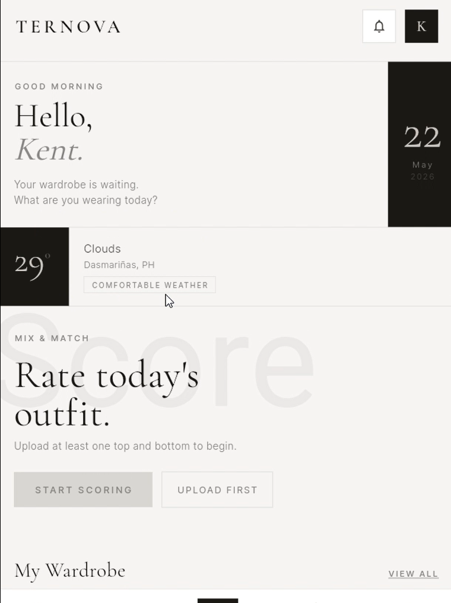
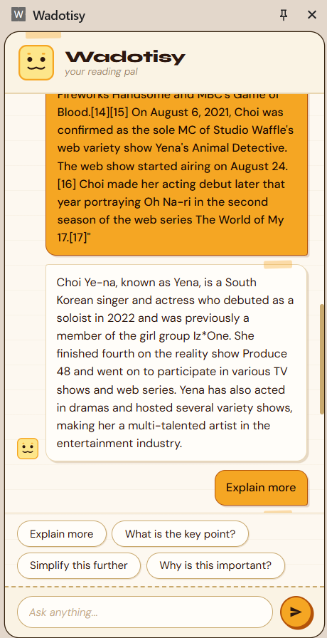
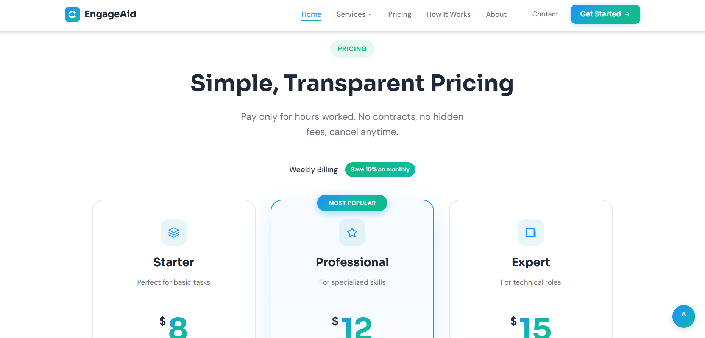

# Kent Condez — Frontend Developer & UI/UX Designer

<p align="center">
  <i>Building products that turn complicated experiences into simple, intuitive interfaces.</i>
</p>

---

## Overview

Personal portfolio showcasing frontend development skills, UI/UX design capabilities, and project organization. Built with vanilla HTML, CSS, and JavaScript — demonstrating strong understanding of core web technologies without relying on frameworks.

This portfolio highlights:
- **4 shipped projects** across mobile apps, web platforms, and browser extensions
- **Responsive design** implementations optimized for all screen sizes
- **Custom UI/UX** including animations, micro-interactions, and accessibility features
- Clean, organized codebase following best practices

---

## Features

### Portfolio Highlights

- **Hero Section** — Animated introduction with staggered reveal effects, custom cursor, and portrait with parallax effect
- **Projects Gallery** — Featured project with browser mockup + grid of additional projects with hover effects
- **Skills Section** — Categorized technical skills (Frontend, Backend, Mobile, Design, Tools)
- **About Section** — Personal philosophy, education background, and quick stats
- **Contact Section** — Multiple contact channels (Email, GitHub, LinkedIn, Resume)
- **Responsive Design** — Fully optimized for mobile, tablet, and desktop
- **Accessibility** — ARIA labels, semantic HTML, keyboard navigation support
- **Performance** — Vanilla JS with no dependencies, smooth animations with reduced motion support

### Technical Implementations

- Custom cursor with hover states
- Scroll progress indicator
- Intersection Observer for scroll reveal animations
- Mobile navigation drawer
- Magnetic button effects
- Typography-focused design with Cormorant Garamond + DM Sans
- CSS custom properties (design tokens)
- BEM naming convention

---

## Tech Stack

| Category | Technologies |
|----------|-------------|
| **Frontend** | HTML5, CSS3, JavaScript (ES6+) |
| **Fonts** | Cormorant Garamond, DM Sans (Google Fonts) |
| **Design** | Figma, Canva |
| **Tools** | Git, GitHub, VS Code |
| **Other Skills** | Flutter, Firebase, React, TypeScript, Node.js |

---

## Installation

No installation required — this is a static website. Simply open `index.html` in your browser.

```bash
# Clone the repository
git clone https://github.com/Kenteu5/Portfolio2026.git

# Navigate to the project
cd Portfolio2026

# Open in browser (macOS)
open index.html

# Or use a local server (Python)
python -m http.server 8000
```

---

## Running Locally

1. **Open directly** — Double-click `index.html` to open in your default browser
2. **Local server** — For best results (proper font loading), use a local server:

```bash
# Using Python 3
python -m http.server 8000

# Then visit http://localhost:8000
```

---

## Folder Structure

```
Portfolio2026/
├── index.html          # Main HTML file
├── styles.css         # All styles (CSS custom properties, components, responsive)
├── main.js           # JavaScript modules (cursor, nav, animations, etc.)
├── ResumeJune2026.pdf # PDF Resume
├── README.md         # This file
└── assetes/          # Images and assets
    ├── Ternova.png              # Featured project screenshot
    ├── Wadotisy.png            # Project screenshot
    ├── EngageAid.png           # Project screenshot
    ├── SogieLegalAdvisorySysterm.png
    └── FormalPicture.png       # Portrait photo
```

---

## Screenshots

### Hero Section


### Featured Project — Ternova


### Project — Wadotisy


### Project — EngageAid


### Project — SOGIE Legal Advisory System


---

## Future Improvements

Areas planned for enhancement:

- **Animations** — Add more sophisticated entrance animations
- **Dark Mode** — Theme toggle with CSS custom properties
- **Performance** — Lighthouse score optimization
- **SEO** — Meta tags and Open Graph improvements
- **blog** — Add featured writing / case studies
- **Contact Form** — Functional form with backend integration

---

## Author

<p align="center">
  <strong>Kent Condez</strong><br>
  Frontend Developer & UI/UX Designer<br>
  <a href="mailto:kentcondezbs@gmail.com">kentcondezbs@gmail.com</a><br>
  <a href="https://github.com/Kenteu5">GitHub</a> · <a href="https://www.linkedin.com/in/kent-condez-b532782a7">LinkedIn</a>
</p>

---

<p align="center">
  <sub>© 2026 Kent Condez. Built with vanilla HTML, CSS, and JavaScript.</sub>
</p>
